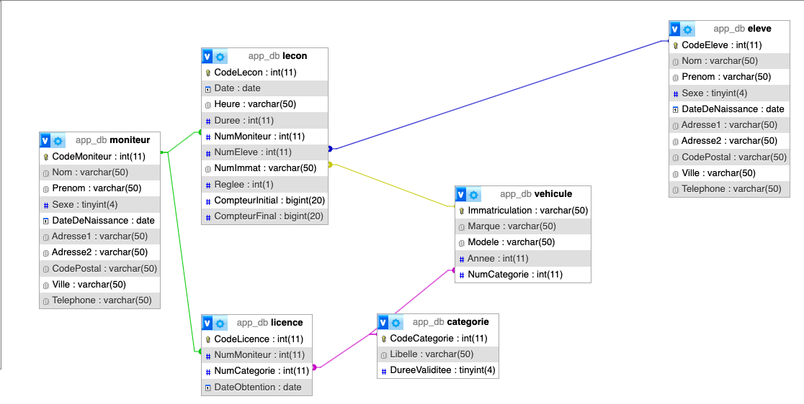

# EVAL 1 - Base de données AutoEcole 

## Objectif

Ecrire des requêtes de selection spécifiques sur la base de données définit par le schema suivant

## Installation

- Cloner le projet
- Démarrage des conteneurs docker `docker compose up -d`

## Requêtes à effectuer

1.  Quels sont les élèves (nom + prénom + date de la leçon) qui ont pris des leçons avec le moniteur Catard Olivier au mois de Septembre 2017 sur un véhicule de marque « Renault ».
2.  Combien de véhicules de catégorie « Moto » ont été conduits par des élèves de sexe féminin (= à 1).
3.	Quels sont les moniteurs (nom + prénom) qui possèdent une licence pour la catégorie « Poids lourd ».
4.	Quels sont les véhicules (immatriculation + marque + modèle) qui ont réalisés plus de 15 leçons. La liste devra être triée par ordre décroissant sur le nombre de leçons.
5.	Quels sont les véhicules (immatriculation) qui sont de la même année que le véhicule immatriculé « 678 FG 21 »
6.	Quels sont les moniteurs (nom + prénom) qui n’ont jamais pris de leçons sur un véhicule de marque « Peugeot »
7.	Quel est le nombre de kilomètres total parcouru par le moniteur « Catard ».
8.  Quel est le véhicule (immatriculation + marque + modèle + année) le plus vieux.
